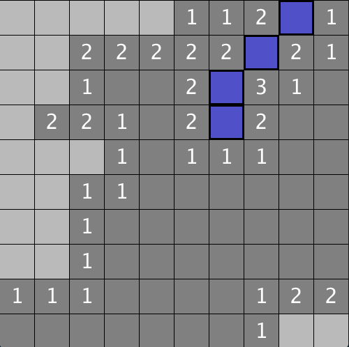

# Minesweeper
Minesweeper in processing, standard rules.

Right click to place flag, left click to check a cell.

Change the new Grid(10, 10); instantiation in MineSweeper.pde to another set of values to increase the grid size.

